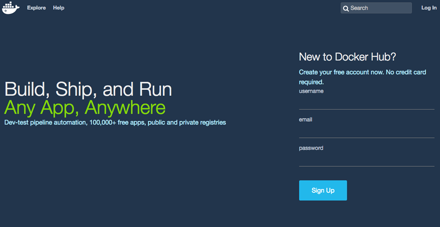
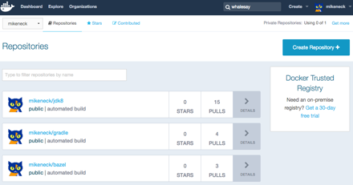
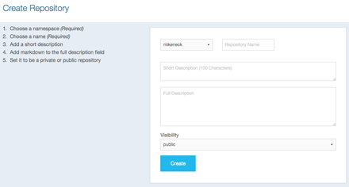
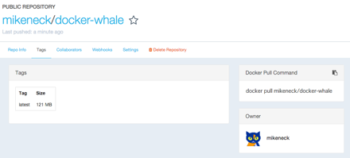

Docker Hubでのイメージの公開と利用
===

このドキュメントでは[自作のDockerイメージ](2-first-image.md)をDocker Hubに公開する手順が記述されています。

### Docker Hubへサインアップ

* [Docker Hub](https://hub.docker.com/)へサインアップします。
* 下記の`username`、`email`、`password`を記入した上で、「Sign Up」ボタンを押します。
* 確認メールがくるので、そのメールに記載されているURLにアクセスして登録完了です。



### レポジトリーの作成

* Docker Hubにログインした状態で「Create Repository」ボタンを押します。



* 「Create Repository」画面で次の項目を入力し、「Create」ボタンを押します
** user name
** repository name
** Short description(Optional)
** Full description(Optional)
** Visibility(Privateは無料版では1つまで)



### Docker tagコマンドでイメージ名を変更する

Docker Hubではイメージは`user-name`/`reoisitory-name`:`version`の形式で管理されます(`version`は指定がない場合は`latest`になる)。

先ほど作成したイメージは`docker-whale`は上記の規約に則っていないため、`docker tag`コマンドを用いて、イメージの名前を修正します。

* まず、イメージのIDを取得するために`docker images`コマンドを実行します

```
$ docker images
REPOSITORY             TAG                 IMAGE ID            CREATED             VIRTUAL SIZE
docker-whale           latest              446c9c19f799        About an hour ago   274 MB
hello-world            latest              af340544ed62        8 weeks ago         960 B
docker/whalesay        latest              fb434121fc77        4 months ago        247 MB
```

* IMAGE IDの`446c9c`が先ほど作成したイメージです。
* これの名前(REPOSITORY)を`user-name/repository-name`の形式に変更します。

```
docker tag 446c9c mikeneck/docker-whale:latest
```

`docker tag`コマンド実行後の`docker images`コマンドの結果は次のようになります。

```
$ docker images
REPOSITORY              TAG                 IMAGE ID            CREATED             VIRTUAL SIZE
docker-whale            latest              446c9c19f799        About an hour ago   274 MB
mikeneck/docker-whale   latest              446c9c19f799        About an hour ago   274 MB
hello-world             latest              af340544ed62        8 weeks ago         960 B
docker/whalesay         latest              fb434121fc77        4 months ago        247 MB
```

`docker-whale`と同じIDで異なる名前の`mikeneck/docker-whale`というイメージがあることがわかります。

このあと、このイメージをDocker Hubで公開します

### Docker Hubへログイン

* ターミナルからDockerに`docker login`コマンドによって、Docker Hubにログインします

```
docker login --username=docker-hub-username --password=docker-hub-password --email=docker-hub-mail@address.com
```

このコマンドが成功すると、`~/.docker/config.json`というファイルに認証情報が書き込まれます。

### Docker Hubにイメージをpushする

* ログイン完了後に`docker push`コマンドによって、作成したイメージをDocker Hubにpushします。

```
docker push mikeneck/docker-whale
```

次のようなログが出力されます。

```
The push refers to a repository [docker.io/mikeneck/docker-whale] (len: 1)
446c9c19f799: Image successfully pushed
1eacb147f8f6: Image successfully pushed
fb434121fc77: Image already exists
5d5bd9951e26: Image already exists
99da72cfe067: Image already exists
1722f41ddcb5: Image already exists
5b74edbcaa5b: Image already exists
676c4a1897e6: Image already exists
07f8e8c5e660: Image already exists
37bea4ee0c81: Image already exists
a82efea989f9: Image already exists
e9e06b06e14c: Image already exists
latest: digest: sha256:e8a6f4430586e22ce6a3cc0ae96b1077d7b10a1bb7e9e3e2df3fdc979e2718a7 size: 22098
```

先ほどWebのUIで作成したレポジトリーの画面の「Tags」タブを開くと、イメージのサイズが表示されます。



この後は、作成したレポジトリーを`pull`します。

### イメージの削除

ローカルにDocker Hubと同じイメージがあると、`pull`することができないので、一度イメージを消します。

イメージを消すためのコマンドは次の二通りです。

* `docker rmi -f repository-name`
* `docker rmi -f id`

```
$ docker images
REPOSITORY              TAG                 IMAGE ID            CREATED             VIRTUAL SIZE
docker-whale            latest              446c9c19f799        About an hour ago   274 MB
mikeneck/docker-whale   latest              446c9c19f799        About an hour ago   274 MB
hello-world             latest              af340544ed62        8 weeks ago         960 B
docker/whalesay         latest              fb434121fc77        4 months ago        247 MB
```

現在、ローカルにあるイメージは上記のとおりになっており、これらのうち上二つを消します。

```
$ docker rmi -f docker-whale
Untagged: docker-whale:latest
$ docker rmi -f 446c9c
Untagged: mikeneck/docker-whale:latest
Deleted: 446c9c19f799e5caf71f154ee7157e687f956691b39e456b0ed6341b8a05354e
Deleted: 1eacb147f8f6a6dabb8d7a55ca35296142996de32cf8b8d5200a15bd0cb9e99c
```

このコマンド実行後のローカルにあるイメージは次のようになります。

```
$ docker images
REPOSITORY             TAG                 IMAGE ID            CREATED             VIRTUAL SIZE
hello-world            latest              af340544ed62        8 weeks ago         960 B
docker/whalesay        latest              fb434121fc77        4 months ago        247 MB
```

### pullコマンドを実行

`docker pull`コマンドにて自作のイメージをダウンロードします。

```
docker pull user-name/repository-name:version
```

の形式でイメージを指定してダウンロードします。

```
$ docker pull mikeneck/docker-whale
Using default tag: latest
latest: Pulling from mikeneck/docker-whale
1eacb147f8f6: Pull complete
446c9c19f799: Pull complete
e9e06b06e14c: Already exists
a82efea989f9: Already exists
37bea4ee0c81: Already exists
07f8e8c5e660: Already exists
676c4a1897e6: Already exists
5b74edbcaa5b: Already exists
1722f41ddcb5: Already exists
99da72cfe067: Already exists
5d5bd9951e26: Already exists
fb434121fc77: Already exists
Digest: sha256:e8a6f4430586e22ce6a3cc0ae96b1077d7b10a1bb7e9e3e2df3fdc979e2718a7
Status: Downloaded newer image for mikeneck/docker-whale:latest
```

では、ローカルにあるイメージを見てみましょう。

```
$ docker images
REPOSITORY              TAG                 IMAGE ID            CREATED             VIRTUAL SIZE
mikeneck/docker-whale   latest              446c9c19f799        About an hour ago   274 MB
hello-world             latest              af340544ed62        8 weeks ago         960 B
docker/whalesay         latest              fb434121fc77        4 months ago        247 MB
```

先ほどと同じ動作をするか、確認してみます。

```
$ docker run mikeneck/docker-whale
 ________________________________________
/ Most people don't need a great deal of \
| love nearly so much as they need a     |
\ steady supply.                         /
 ----------------------------------------
    \
     \
      \
                    ##        .
              ## ## ##       ==
           ## ## ## ##      ===
       /""""""""""""""""___/ ===
  ~~~ {~~ ~~~~ ~~~ ~~~~ ~~ ~ /  ===- ~~~
       \______ o          __/
        \    \        __/
          \____\______/
```
